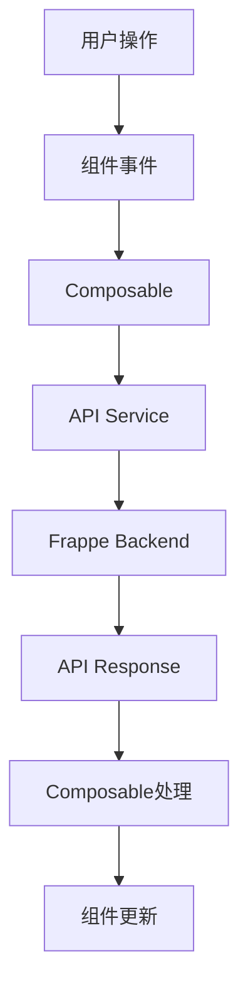

# 前端重构计划 - 使用新Dashboard API

## 📋 重构目标

将现有的看板页面从旧API迁移到新的v1 API架构，提升代码质量和可维护性。

## 🎯 核心改进

### 1. API层重构
- ✅ 使用新的 `product_sales_planning.api.v1.dashboard` API
- ✅ 创建统一的API服务层
- ✅ 改进错误处理和加载状态管理

### 2. 组件化改进
- ✅ 提取可复用的Composables
- ✅ 优化组件结构
- ✅ 改进状态管理

### 3. 用户体验优化
- ✅ 更好的加载状态
- ✅ 错误提示优化
- ✅ 性能优化

## 📁 文件结构

```
frontend/src/
├── services/
│   └── api/
│       ├── dashboard.js          # Dashboard API服务
│       ├── store.js              # Store API服务
│       ├── commodity.js          # Commodity API服务
│       ├── approval.js           # Approval API服务
│       └── index.js              # API统一导出
├── composables/
│   ├── useDashboard.js           # Dashboard业务逻辑
│   ├── useFilters.js             # 筛选器逻辑
│   └── useApi.js                 # API通用逻辑
├── components/
│   └── dashboard/
│       ├── DashboardFilters.vue  # 筛选器组件
│       ├── DashboardStats.vue    # 统计卡片组件
│       ├── DashboardTabs.vue     # 标签页组件
│       └── TaskCard.vue          # 任务卡片组件
└── pages/
    └── PlanningDashboard.vue     # 重构后的看板页面
```

## 🔄 API迁移对照表

### 旧API → 新API

| 功能 | 旧API | 新API |
|------|-------|-------|
| 获取看板数据 | `planning_dashboard.get_dashboard_data` | `product_sales_planning.api.v1.dashboard.get_dashboard_data` |
| 获取过滤选项 | `planning_dashboard.get_filter_options` | `product_sales_planning.api.v1.dashboard.get_filter_options` |

### API参数变化

**get_dashboard_data**
```javascript
// 旧参数
{
  filters: JSON.stringify({
    store_ids: [],
    task_ids: [],
    approval_status: '',
    tab: 'pending'
  })
}

// 新参数
{
  filters: {
    store_ids: [],
    task_ids: [],
    approval_status: '',
    status: 'pending'  // 改名
  },
  search_text: '',     // 新增
  sort_by: 'deadline', // 新增
  sort_order: 'asc'    // 新增
}
```

## 🛠️ 实施步骤

### Phase 1: 创建API服务层 ✅
1. 创建 `services/api/dashboard.js`
2. 创建 `services/api/index.js`
3. 封装所有Dashboard API调用

### Phase 2: 创建Composables ✅
1. 创建 `composables/useApi.js` - 通用API逻辑
2. 创建 `composables/useDashboard.js` - Dashboard业务逻辑
3. 创建 `composables/useFilters.js` - 筛选器逻辑

### Phase 3: 组件拆分 ✅
1. 提取 `DashboardFilters.vue` - 筛选器
2. 提取 `DashboardStats.vue` - 统计卡片
3. 提取 `DashboardTabs.vue` - 标签页
4. 提取 `TaskCard.vue` - 任务卡片

### Phase 4: 重构主页面 ✅
1. 更新 `PlanningDashboard.vue`
2. 使用新的Composables
3. 使用拆分的组件

### Phase 5: 测试和优化 ⏳
1. 功能测试
2. 性能优化
3. 错误处理完善

## 📝 代码示例

### 1. API服务层

```javascript
// services/api/dashboard.js
import { createResource } from 'frappe-ui'

export const dashboardApi = {
  // 获取看板数据
  getDashboardData: (filters, searchText = '', sortBy = 'deadline', sortOrder = 'asc') => {
    return createResource({
      url: 'product_sales_planning.api.v1.dashboard.get_dashboard_data',
      params: {
        filters,
        search_text: searchText,
        sort_by: sortBy,
        sort_order: sortOrder
      }
    })
  },

  // 获取过滤选项
  getFilterOptions: () => {
    return createResource({
      url: 'product_sales_planning.api.v1.dashboard.get_filter_options',
      auto: true
    })
  }
}
```

### 2. Composable

```javascript
// composables/useDashboard.js
import { ref, computed } from 'vue'
import { dashboardApi } from '@/services/api'

export function useDashboard() {
  const filters = ref({
    store_ids: [],
    task_ids: [],
    approval_status: '',
    status: 'pending'
  })

  const searchText = ref('')
  const sortBy = ref('deadline')
  const sortOrder = ref('asc')

  // 创建API资源
  const dashboardData = dashboardApi.getDashboardData(
    filters,
    searchText,
    sortBy,
    sortOrder
  )

  const filterOptions = dashboardApi.getFilterOptions()

  // 计算属性
  const stats = computed(() => dashboardData.data?.stats || {})
  const tasks = computed(() => dashboardData.data?.tasks || [])

  // 方法
  const loadData = () => {
    dashboardData.reload()
  }

  const applyFilters = () => {
    loadData()
  }

  const clearFilters = () => {
    filters.value = {
      store_ids: [],
      task_ids: [],
      approval_status: '',
      status: 'pending'
    }
    searchText.value = ''
    loadData()
  }

  return {
    filters,
    searchText,
    sortBy,
    sortOrder,
    stats,
    tasks,
    filterOptions,
    loadData,
    applyFilters,
    clearFilters,
    isLoading: computed(() => dashboardData.loading)
  }
}
```

### 3. 组件使用

```vue
<!-- pages/PlanningDashboard.vue -->
<template>
  <div class="dashboard">
    <DashboardFilters
      v-model:filters="filters"
      :options="filterOptions"
      @apply="applyFilters"
      @clear="clearFilters"
    />

    <DashboardStats :stats="stats" />

    <DashboardTabs
      v-model="currentTab"
      :tasks="tasks"
      :loading="isLoading"
    />
  </div>
</template>

<script setup>
import { useDashboard } from '@/composables/useDashboard'
import DashboardFilters from '@/components/dashboard/DashboardFilters.vue'
import DashboardStats from '@/components/dashboard/DashboardStats.vue'
import DashboardTabs from '@/components/dashboard/DashboardTabs.vue'

const {
  filters,
  stats,
  tasks,
  filterOptions,
  applyFilters,
  clearFilters,
  isLoading
} = useDashboard()
</script>
```

## 🎨 UI/UX改进

### 1. 加载状态
- 使用骨架屏替代简单的loading
- 局部加载状态，不阻塞整个页面

### 2. 错误处理
- 友好的错误提示
- 重试机制
- 错误边界

### 3. 性能优化
- 虚拟滚动（任务列表很长时）
- 防抖搜索
- 缓存策略

## 📊 数据流



## ✅ 验收标准

### 功能完整性
- [ ] 所有筛选功能正常
- [ ] 数据加载正确
- [ ] 统计数据准确
- [ ] 标签页切换流畅
- [ ] 搜索功能正常
- [ ] 排序功能正常

### 代码质量
- [ ] 代码结构清晰
- [ ] 组件职责单一
- [ ] 可复用性高
- [ ] 类型安全（如使用TypeScript）
- [ ] 注释完整

### 性能指标
- [ ] 首屏加载 < 2s
- [ ] 筛选响应 < 500ms
- [ ] 无内存泄漏
- [ ] 流畅的动画

### 用户体验
- [ ] 加载状态清晰
- [ ] 错误提示友好
- [ ] 操作反馈及时
- [ ] 响应式设计良好

## 🔍 测试计划

### 单元测试
- API服务层测试
- Composable逻辑测试
- 工具函数测试

### 集成测试
- 组件交互测试
- API调用测试
- 状态管理测试

### E2E测试
- 完整用户流程测试
- 边界情况测试
- 性能测试

## 📚 相关文档

- [API文档](../product_sales_planning/docs/api_documentation.md)
- [API测试指南](../API_TEST_README.md)
- [API快速参考](../API_QUICK_REFERENCE.md)

## 🚀 部署计划

### 开发环境
1. 本地测试
2. 功能验证
3. 性能测试

### 测试环境
1. 集成测试
2. 用户验收测试
3. 性能基准测试

### 生产环境
1. 灰度发布
2. 监控告警
3. 回滚方案

## 📝 变更日志

### 2025-12-12
- ✅ 创建重构计划
- ✅ 定义文件结构
- ✅ 设计API服务层
- ✅ 设计Composables
- ⏳ 开始实施

---

**版本**: 1.0.0  
**状态**: 规划中  
**负责人**: 开发团队